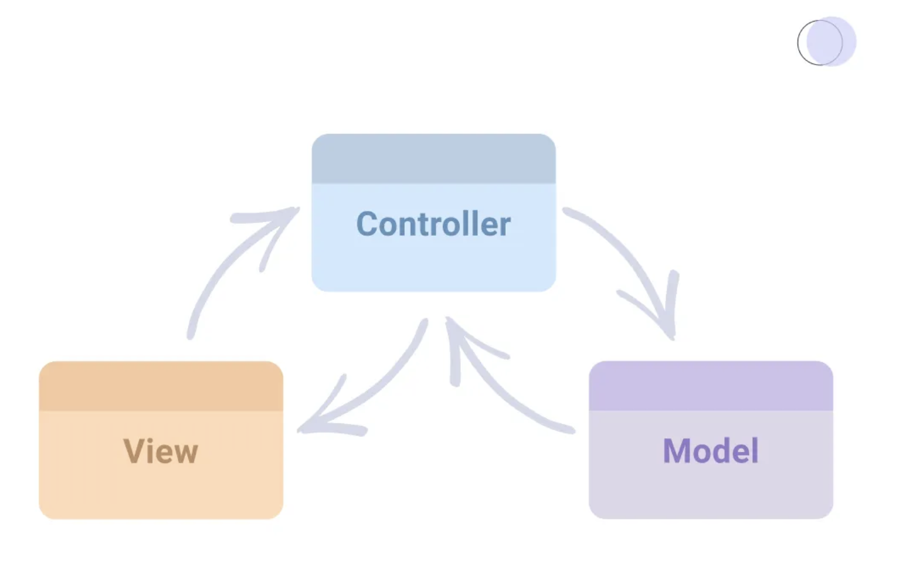
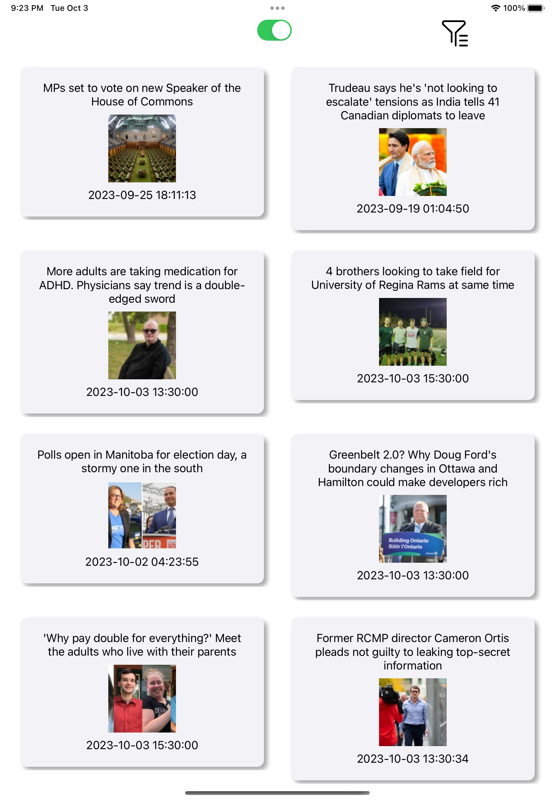

#Project Documentation

### Overview

This iOS app is designed to provide users with easy access to news content from CBC News & Sports. It fetches the latest news articles from the CBC API and presents them in a user-friendly interface. Users can view headlines, images, and publication dates for each news article. The app also offers the ability to filter news articles by type and seamlessly handles network connectivity status. For iPad users, a two-column layout can be toggled using a switch.

### Architecture

Project Structure 
The architecture of the app follows the Model-View-ViewModel (MVVM) pattern, which promotes separation of concerns and enhances code maintainability. In this architecture:

•    Model: Represents the data structures used in the app, including news article models.
•    View: Represents the user interface components, built using UIKit, responsible for displaying data and interacting with the user.
•    ViewModel: Acts as an intermediary between the Model and View layers. It transforms raw data from the Model into a format suitable for presentation in the View, handles user interactions, and performs data filtering.

Dependency Injection in ViewModel
In our iOS app project, we follow the best practice of dependency injection within the ViewModel layer. This approach allows us to decouple dependencies and create ViewModel instances that are highly testable. By adhering to dependency injection principles, we enhance the modularity and maintainability of our codebase.

The app includes a custom network layer for handling API requests and responses without relying on third-party libraries. It ensures efficient and reliable communication with the CBC API. This project maintains a clean project structure, organized into separate directories for Models, Views, ViewModels, Networking, Helper and more. The helper directory consists of all the additional utilities we need such as managers, extensions, constants and many more.
Top of Form
Bottom of Form

This architectural approach allows for a scalable and maintainable codebase, making it easier to add new features and accommodate future enhancements.

### Dependencies

The app is built without the use of third-party libraries or external dependencies. Have opted to implement all features, including network requests, data handling, and user interface components, natively using Swift and UIKit. This choice was made to maintain full control over the codebase, ensuring minimal overhead and a more lightweight app.
By not relying on third-party libraries, we have reduced the risk of compatibility issues and have full flexibility in customizing and optimizing our app's functionality to meet the specific requirements of fetching and displaying news content from CBC News & Sports.

### Network Layer

The custom network layer is a critical component of the app's architecture. It handles all interactions with the CBC API, ensuring that data is fetched and processed efficiently. Key aspects of our network layer include:
•    API Request Configuration: We carefully configure each API request to include necessary headers, parameters, and endpoints. This configuration ensures that our requests are appropriately structured and aligned with the CBC API's requirements. Thus, all the network urls are in the Config file within the Network directory.
•    Error Handling: Robust error handling is integrated into our network layer to handle various scenarios, such as network connectivity issues, server errors, or unexpected responses. We provide clear error messages and feedback to users when issues arise with alerts. Therefore, it’s worth checking the Helper->Structs->Network Error and Alerts directories.
•    Response Parsing: The network layer efficiently parses API responses with native Codable protocol provided by apple, transforming raw data into usable models that can be displayed in the app's user interface. This parsing process is crucial for presenting news articles with headlines, images, and publication dates.
•    Network Connectivity Monitoring: Have incorporated a custom written network connectivity monitoring to inform users if the app loses network connectivity. This feature enhances the user experience by providing clear feedback when a reliable network connection is required.

### UI Design

### UICollectionView and UICollectionViewCompositionalLayout
One of the key features of our app is the use of UICollectionView along with UICollectionViewCompositionalLayout. This combination allows us to efficiently display news articles in a scrollable, grid-like format, enhancing the user's ability to explore a variety of articles easily.

UICollectionViewCompositionalLayout: UICollectionViewCompositionalLayout empowers us to create dynamic and visually pleasing grid layouts that automatically adjust based on the available screen space. It ensures that our app's UI looks and functions optimally on both iPhone and iPad devices.

XIBs for Interface Components:
To streamline the UI design process and maintain a modular codebase, we make extensive use of XIB files (Interface Builder) for creating custom interface components. XIBs allow us to design reusable views, cells, and layout elements visually, reducing the complexity of our code and promoting code reusability.

### Testing

Dependency injection facilitates unit testing by enabling us to provide mock or stub dependencies when creating ViewModel instances. This way, we can isolate specific parts of our ViewModel for testing, ensuring that it behaves as expected in isolation.

InMemory Coredata stack is being used to execute the unit tests 

### Offline Persistence
The App provides offline syncing capabilities with Coredata and the CoreDataManager class provides a centralized and efficient way to manage Core Data operations in your app. It follows the Singleton design pattern to ensure a single instance throughout the app's lifecycle, which helps maintain data consistency.
Key components of the architecture:
1.    Core Data Stack: The class utilizes a Core Data stack (CoreDataStack) to manage Core Data operations. It maintains two Core Data contexts:
•    privateMOC (Private Managed Object Context): Used for background tasks and data processing. It operates on a private queue to avoid blocking the main thread.
•    managedObjectContext (Main Managed Object Context): The main thread's context for UI interactions. It's the context used by the UI components.
2.    Fetching Data: The fetchData function is a generic method that allows you to fetch data from Core Data entities using an entity name, optional custom predicates, and a completion handler. It fetches data in the background (privateMOC) and passes the results to the completion handler.
3.    Synchronization: The synchronize method is responsible for synchronizing changes made in the privateMOC with the main managedObjectContext. It saves changes in the private context and then saves changes to the main context, ensuring that data changes are propagated correctly. This synchronization process helps maintain data consistency and prevents data loss.

Overall, the CoreDataManager class encapsulates the complexities of Core Data management and provides a clean and organized interface for handling data operations, making it easier to work with Core Data in your app.

### Pagination

This app features a robust pagination mechanism, allowing users to seamlessly load additional news articles as they scroll through the list . This enhances the user experience by providing a continuous flow of content. Here's how pagination works in our app:

paginatedNewsURL Function
To request paginated news items, we have implemented a dedicated function called paginatedNewsURL within our Config struct. This function accepts the following parameters:
•    nextPage: The page number of the next set of news articles to load.
•    pageSize: The number of news articles to fetch per page.
•    offset: The offset value, which specifies the number of items to skip before fetching the next set.

Offset Parameter
The offset parameter plays a crucial role in determining which news articles are loaded. By providing an offset value, we instruct the API to skip a specific number of items before retrieving the next batch. This allows us to efficiently navigate through the entire dataset of news articles.

### Instructions for Running the Project
As no 3rd party libraries been used no need of any additional setup other than the latest Xcode and MacOS

### Conclusion

This iOS app project, intention was to create a feature-rich application that fetches and displays news content from CBC News & Sports. The development approach encompasses architectural best practices, efficient network communication, a user-friendly interface, and comprehensive testing.
Have adhered to the Model-View-ViewModel (MVVM) architectural pattern, ensuring separation of concerns and maintainability. Our use of UIKit, UICollectionView, and UICollectionViewCompositionalLayout enhances the user experience by providing a visually appealing and responsive news reading environment.

Commitment to testing, both through XCTest for unit and UI tests, guarantees the reliability and functionality of our codebase. Have prioritized dependency injection in the ViewModel layer, enabling effective unit testing and code modularity.
The incorporation of pagination enhances the user experience, allowing seamless loading of news articles as users scroll through the content. 

